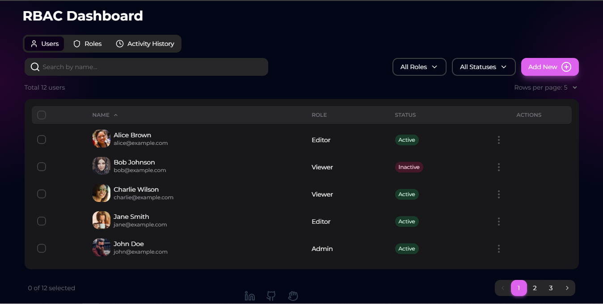

# RBAC Dashboard

A user-friendly Role-Based Access Control (RBAC) dashboard built with React and Vite. This app helps you manage users, roles, and permissions, and keeps track of activities in real-time.


[Try it - https://www.dummy.com ](https://www.dummy.com)


## What's Inside

### User Management
- 👥 Add, view, edit, and delete users
- 🔍 Easy search and filter options
- 📊 Sortable user list with pages
- 🔄 See user status updates instantly
- 👤 Manage user profiles with pictures

### Role Management
- 🛡️ Create and change roles
- 🔐 Set detailed permissions for each role
- 📝 Add descriptions to roles
- 🔍 Quick role search
- ✅ Simple checkboxes for permissions

### Activity Tracking
- 📜 See all actions as they happen
- ⏱️ View activities in time order
- 👁️ Track every change made in the system
- 🔄 Auto-updates without refresh
- 📊 See activity summaries


## How to Use

### Working with Users

1. Click on the Users tab
2. Use the search box to find users
3. Use dropdown menus to filter users
4. Click "Add New" to create a user
5. Click the "..." menu to edit or delete users


### Working with Roles

1. Go to the Roles tab
2. Add new roles and set their permissions
3. Change permissions for existing roles
4. Use the search box to find roles
5. Remove roles you don't need anymore


### Checking Activities

1. Open the Activity History tab
2. See a list of all actions, newest first
3. Scroll down to see older activities


## Tech We Used

- ⚡ **React** - For building our user interface
- 🛠️ **Vite** - Fast build tool and development server
- 💅 **NextUI** - Good-looking UI parts
- 📦 **Tailwind CSS** - For quick and easy styling
- 🎨 **Lucide Icons** - Nice-looking, free icons

## How It's Organized
```
src/
├── pages/ 
│   └── Dashboard
│       └── Dashboard.jsx
├── components/         # React building blocks
│   ├── UserManagement.jsx
│   ├── UserForm.jsx
│   ├── RoleManagement.jsx
│   ├── RoleForm.jsx
│   └── ActivityHistory.jsx
├── utils/             # Helper functions
│   ├── tableUtils.js
│   └── logUtils.js
└── data/              # Starter data
    └── initialData.js

```

## Getting Started

### What You Need

- Node.js 14 or later
- npm or yarn

### Setting Up

1. Get the code:
```bash
git clone https://github.com/Rohit-Nandagawali/rbac-ui.git
cd rbac-ui
```

2. Install the necessary packages:


```shellscript
npm install
# or
yarn install
```

3. Start the development server:


```shellscript
npm run dev
# or
yarn dev
```

4. Open your web browser and go to [http://localhost:5173](http://localhost:5173) to see the app.


## Need Help?

For help, email [support@example.com](mailto:support@example.com) or open an issue in this project